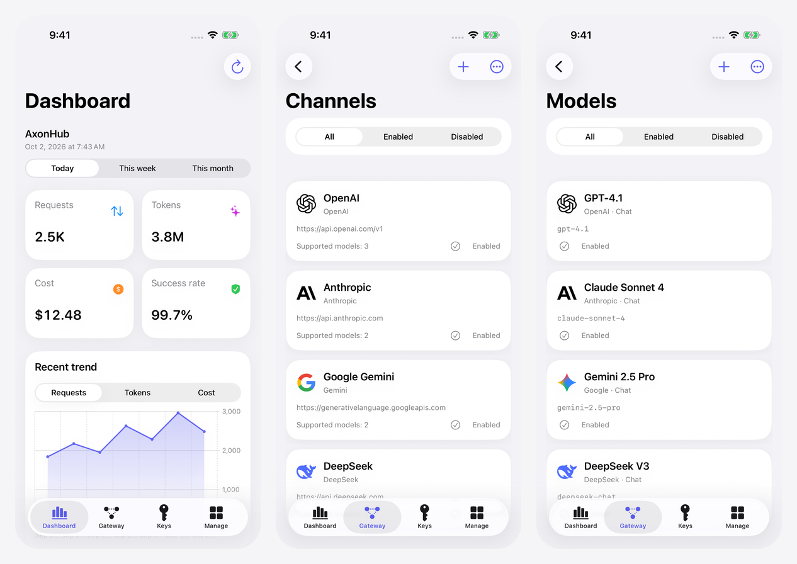

# Axonapp

[English](README.md) | [简体中文](README.zh-CN.md) | [繁體中文](README.zh-TW.md) | **한국어** | [日本語](README.ja.md)

Axonapp은 [AxonHub](https://github.com/looplj/axonhub) 인스턴스를 관리하는 iPhone 및 iPad용 독립적인 서드파티 클라이언트입니다. AxonHub 프로젝트와 제휴 관계가 없으며 공식적으로 승인된 앱이 아닙니다. 사용량 확인과 채널, 모델, 접근 권한 관리를 지원합니다.

SwiftUI로 제작되었으며 iOS 16 이상을 지원합니다. iOS 26에서는 Liquid Glass 인터페이스를 제공합니다.

## 미리 보기

<p align="center">
  
</p>

## 주요 기능

- **대시보드** — 요청 수, 토큰 수, 비용, 성공률, 일별 추이와 채널 성능을 확인합니다.
- **채널 및 모델** — 공급자 설정, 상위 모델 가져오기, 연결 테스트와 모델 라우팅 관리를 지원합니다.
- **API 키** — 키 생성·교체, 모델 접근 권한, 채널 제한, 정책과 할당량을 설정합니다.
- **요청 및 사용량** — 요청, 추적, 대화와 사용량 기록을 조회하고 지연 시간과 토큰 소비량을 확인합니다.
- **관리 기능** — 프로젝트, 구성원, 사용자, 역할, 프롬프트 보호, 저장소와 시스템 설정을 관리합니다.
- **개인화** — 여러 인스턴스 전환, 라이트·다크 테마와 사용자 지정 강조색을 지원합니다.
- **다국어** — 중국어 간체·번체, 영어, 일본어, 한국어를 지원합니다.
- **직접 연결과 개인정보 보호** — 자격 증명은 기기의 Keychain에 저장하며 기본적으로 HTTPS를 사용합니다. 중계 서비스나 분석 SDK를 사용하지 않습니다.

## 다운로드 및 설치

**iOS / iPadOS 16.0 이상**이 필요합니다.

1. [Releases](https://github.com/Likhixang/Axonapp-iOS/releases/latest)에서 `Axonapp.ipa`를 다운로드합니다.
2. SideStore, AltStore 또는 개인 서명 인증서로 서명하여 설치합니다.
3. **설정 → 인스턴스 추가**에서 AxonHub 주소를 입력하고 관리자 계정으로 로그인합니다. 일반 API 키로는 사용 가능한 모델 목록만 조회할 수 있습니다.

## 로컬 빌드

**macOS, Xcode 26, XcodeGen**이 필요합니다. 타사 런타임 의존성은 없습니다.

```sh
brew install xcodegen
xcodegen generate
open Axonapp.xcodeproj
```

기기에 설치하려면 Xcode에서 본인의 서명 팀을 선택하고 코드 서명을 활성화하세요.
