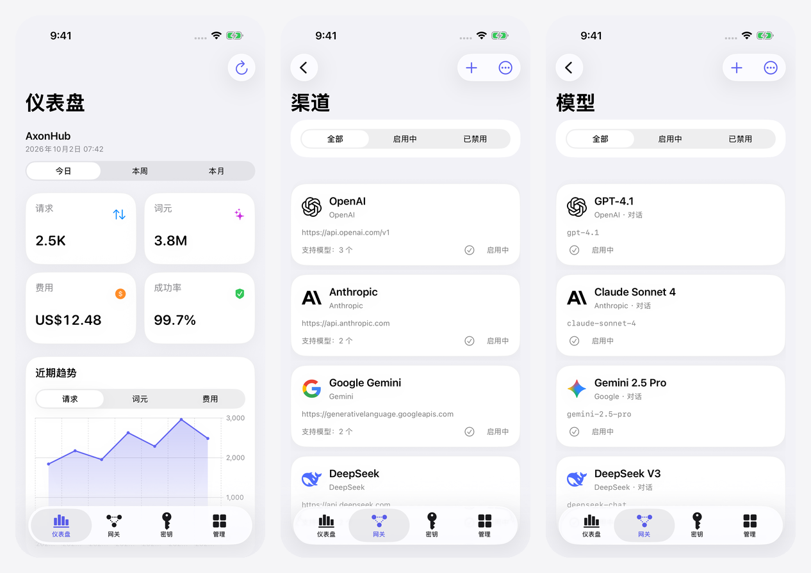

# Axonhub App iOS

[English](README.md) | **简体中文**

面向 iPhone 和 iPad 的原生 [AxonHub](https://github.com/looplj/axonhub) 管理应用。在手机上查看网关用量、管理渠道与模型、配置访问权限。

使用 SwiftUI 构建，支持 iOS 16 及以上版本，在 iOS 26 上采用 Liquid Glass。

## 界面预览

<p align="center">
  
</p>

## 功能亮点

- **仪表盘** — 请求、词元、费用、成功率、每日趋势与渠道性能。
- **渠道与模型** — 配置供应商、获取上游模型、测试连通性、管理模型路由。
- **密钥管理** — 创建与轮换密钥，配置模型权限、渠道限制、策略与额度。
- **请求与用量** — 浏览请求、追踪、对话及用量记录，查看延迟与词元消耗。
- **管理功能** — 项目、成员、用户、角色、提示词防护、存储与系统设置。
- **个性化** — 多实例切换、深浅色外观与自定义强调色。
- **多语言** — 简体中文、繁體中文、English、日本語、한국어。
- **安全直连** — 凭据保存在本机 Keychain，默认使用 HTTPS，无中转服务或分析 SDK。

## 安装

需要 **iOS / iPadOS 16.0 或更高版本**。

1. 从 [Releases](https://github.com/Likhixang/Axonhub-App-iOS/releases/latest) 下载 `Axonhub-App-iOS-unsigned.ipa`。
2. 使用 SideStore、AltStore 或自己的签名证书签名并安装。
3. 打开 **设置 → 新增实例**，填写 AxonHub 地址并使用管理员账号登录。普通 API Key 仅可查看可用模型列表。

## 本地构建

需要 **macOS、Xcode 26 和 XcodeGen**，无第三方运行时依赖。

```sh
brew install xcodegen
xcodegen generate
open Axonhub.xcodeproj
```

如需安装到设备，请在 Xcode 中选择自己的签名团队并启用代码签名。
